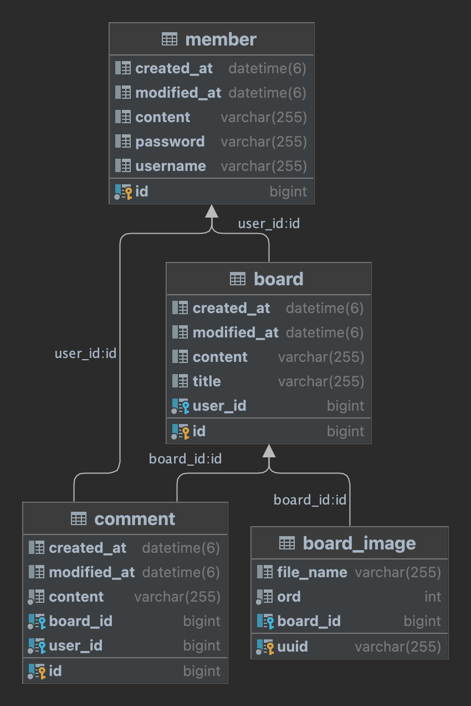

# 📻 News Feed Project


## 📇 개요
<b>뉴스피드(New Speed 아님!) 팀 프로젝트</b><br>
코딩하면서 어떤 노래를 들으시나요? 한눈에 볼 수 있는 개발자들의 플레이리스트<br>
서로의 플레이리스트를 공유하며 다양한 음악을 접해보자!

## 💾 디렉토리 구조
계층별로 나누지 않고 도메인으로 나누어 관리하는 전략을 선택했다.
```
── src/
│   ├── main/
│   │   ├── java/
│   │   │   └── com/
│   │   │       └── sparta/
│   │   │           └── newsfeed/
│   │   │               ├── NewsFeedApplication.java
│   │   │               ├── advice/
│   │   │               │   └── CustomRestAdvice.java
│   │   │               ├── auth/
│   │   │               │   └── MainController.java
│   │   │               ├── board/
│   │   │               │   ├── controller/
│   │   │               │   ├── domain/
│   │   │               │   ├── dto/
│   │   │               │   ├── repository/
│   │   │               │   └── service/
│   │   │               ├── comment/
│   │   │               │   ├── controller/
│   │   │               │   ├── domain/
│   │   │               │   ├── dto/
│   │   │               │   ├── repository/
│   │   │               │   └── service/
│   │   │               ├── config/
│   │   │               │   ├── CustomServletConfig.java
│   │   │               │   └── RootConfig.java
│   │   │               ├── domain/
│   │   │               │   └── BaseEntity.java
│   │   │               ├── file/
│   │   │               │   ├── controller/
│   │   │               │   ├── domain/
│   │   │               │   └── dto/
│   │   │               ├── member/
│   │   │               │   ├── controller/
│   │   │               │   ├── domain/
│   │   │               │   ├── dto/
│   │   │               │   ├── repository/
│   │   │               │   └── service/
│   │   │               └── security/
│   │   │                   ├── config/
│   │   │                   ├── jwt/
│   │   │                   └── service/
│   │   └── resources/
│   │       ├── application.properties
│   │       ├── static/
│   │       └── templates/
│   │           ├── login.html
│   │           ├── mainpage.html
│   │           └── signup.html
│   └── test/
│       └── java/
│           └── com/
│               └── sparta/
│                   └── newsfeed/
│                       ├── DataSourceTests.java
│                       ├── NewsFeedApplicationTests.java
│                       ├── board/
│                       │   ├── domain/
│                       │   ├── repository/
│                       │   └── service/
│                       ├── comment/
│                       │   ├── repository/
│                       │   └── service/
│                       ├── member/
│                       │   └── repository/
│                       └── security/
│                           └── jwt/
└── upload/
    ├── b7dea34d-3338-47e9-bfa9-91204954fe6a_2620.jpg
    ├── s_9fae02c9-f0f5-4d97-a97e-3ff64f5b8585_2620.jpg
    └── s_b7dea34d-3338-47e9-bfa9-91204954fe6a_2620.jpg

```

## 📔 Stacks
 
 


## ⚙ 기능
### 회원가입
  * 사용자는 해당 서비스에 아이디와 패스워드로 가입할 수 있다.
### 로그인/로그아웃
  * 사용자는 회원가입한 아이디로 로그인하여 해당 서비스를 이용할 수 있다.
### 토큰 기반 인증
  * 로그인에 성공하면 서버에서 JWT토큰을 발급해주고 토큰이 필요한 경로에 요청을 보내 서비스를 이용할 수 있다.
### 뉴스피드 작성하기
*  사용자는 로그인한 뒤 이미지등의 파일과 함께 자신의 플레이리스트를 동료 개발자들과 공유할 수 있다.
### 뉴스피드 수정하기
  * 사용자는 자신이 작성한 뉴스피드를 수정할 수 있다.
### 뉴스피드 삭제하기
  * 사용자는 자신이 작성한 뉴스피드를 삭제할 수 있다.
### 뉴스피드에 댓글 남기기
  * 댓글을 통해 자신의 의견을 나타낼 수 있다.
### 댓글 수정/삭제
  * 자신이 남긴 댓글을 수정 또는 삭제할 수 있다.

## 📚 API 명세서
### 📊 Swagger-Ui
* [API 테스트](http://localhost:8080/swagger-ui/index.html)  
### 게시글
* ```POST``` ```/api/boards``` 게시글 작성<br>
* ```PUT``` ```/api/boards/{boardId}``` 게시글 수정<br>
* ```GET``` ```/api/boards/{boardId}``` 게시글 조회<br>
* ```DELETE``` ```/api/boards/{boardId}``` 게시글 삭제<br>
### 댓글
* ```POST``` ```/api/boards/{boardId}/comments``` 댓글 작성<br>
* ```PUT``` ```/api/boards/{boardId}/comments/{commentId}``` 댓글 수정<br>
* ```DELETE``` ```/api/boards/{boardId}/comments/{commentId}``` 댓글 삭제<br>
### 회원 
* ```GET``` ```/api/user/{username}``` 유저 정보 조회
* ```PUT``` ```/api/user/{username}``` 유저 정보 수정
### 파일 업로드
* ```POST``` ```/api/files/``` 이미지 파일 업로드
* ```GET``` ```/api/files/{fileName}``` 이미지 파일 조회
* ```DELETE``` ```/api/files/{fileName}``` 이미지 파일 삭제

## 📔 Documents


## 📸 스크린샷


